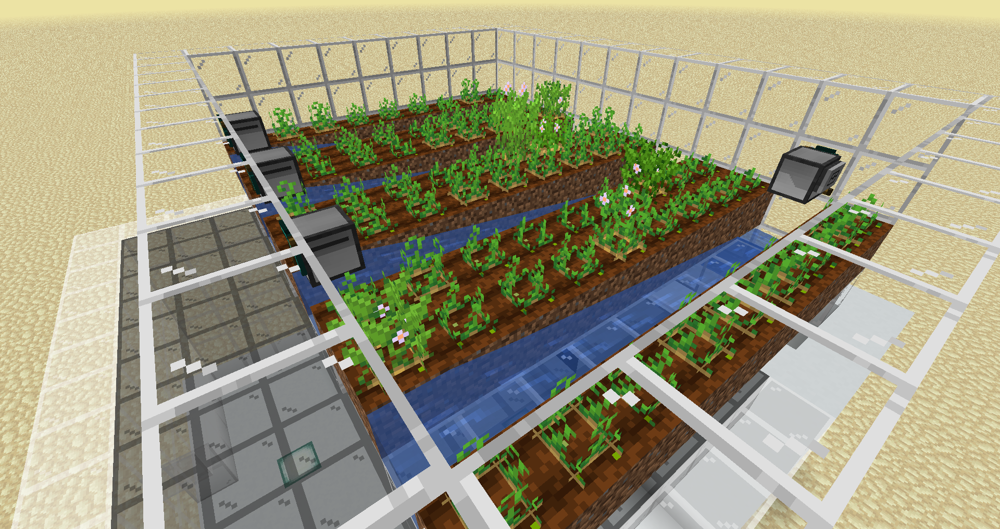

<h1 align="center">CC: Tweaked Potato Amazon</h1>

This is a dumb project, if you are not Michael Reeves or you're not interested in the ComputerCraft Minecraft Mod don't read this because it's written in Lua and I want as few people as possible to get a seizure

  

<h2>First Things To Address</h2>
<ul>
<li>Everything that uses the rednet API is done with wireless modems in my testing world, it can be changed for wired modems</li>
<li>One great person once said: "there is no need for exception handling if you write the code right every time"</li>
</ul>
  

<h2>Try It</h2>

The world folder in this repository has the Minecraft world that I used to test all of this, the entiry facility and store, you need the OfflineTV Better Minecraft mod that you can get <a href="https://www.curseforge.com/minecraft/modpacks/better-minecraft-otv-edition">here</a>.

   

<h2>Pastebin</h2>

All the code can also be found in my <a href="https://pastebin.com/u/Jayex_Designs/1/6ZNaeTu8">pastebin</a> project folder for a easier connection with ComputerCraft.

  

<h2>Explanation</h2>

Here I will explain each part of the project part by part.

 

<h3>Harvest</h3>

The code of the harvest section is mainly Michael Reeves' although I made some tweaks. In essence it's 4 rows of turtles that stay in place until the potato in front of them grows, then they collect all the row and throw the potatoes down the water stream wich goes to the furnaces and then the storage. The code for all 4 turtles is <a href="./scripts/harvest.lua">harvest.lua</a>, to add it to startup you just have to put this commands:<pre><code>edit startup shell.run("harvest")</code></pre>

   

<h3>Vending Machine</h3>

The code of the harvest section is mainly Michael Reeves' although I made some tweaks. In essence it's 4 rows of turtles that stay in place until the potato in front of them grows, then they collect all the row and throw the potatoes down the water stream wich goes to the furnaces and then the storage. The code for all 4 turtles is <a href="./scripts/harvest.lua">harvest.lua</a>, to add it to startup you just have to put this commands:<pre><code>edit startup shell.run("harvest")</code></pre>

