<h1 align="center">CC: Tweaked Potato Amazon</h1>

This is a dumb project, if you are not Michael Reeves or you're not interested in the ComputerCraft Minecraft Mod don't read this because it's written in Lua and I want as few people as possible to get a seizure

  

<h2>First Things To Address</h2>
<ul>
<li>Everything that uses the rednet API is done with wireless modems in my testing world, it can be changed for wired modems except for the deploying section</li>
<li>One great person once said: "there is no need for exception handling if you write the code right every time"</li>
<li>This project made me create a centralized cryptocurrency, a database api, a on-screen keyboard, a drone deploy system and more entirely in lua, to compensate the amount of brain cells i've lost doing this I would appreciate if you check my profile and other projects I've done, maybe even follow me on <a href="https://twitter.com/Jayex_Designs">twitter</a></li>
</ul>
 

<h2>Try It</h2>

The <a href="./world.zip">world</a> folder in this repository compressed in a zip file, is the one I used to test all of this, the entiry facility and store, you need the OfflineTV Better Minecraft mod that you can get <a href="https://www.curseforge.com/minecraft/modpacks/better-minecraft-otv-edition">here</a>.

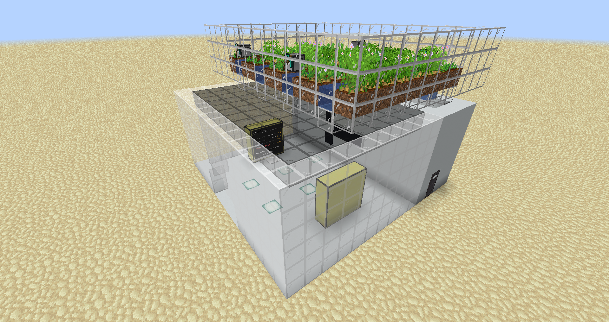
   

<h2>Pastebin</h2>

All the code can also be found in my <a href="https://pastebin.com/u/Jayex_Designs/1/6ZNaeTu8">pastebin</a> project folder for a easier connection with ComputerCraft.

   

<h2>Harvest</h2>

The code of the harvest section is mainly Michael Reeves' although I made some tweaks. In essence it's 4 rows of turtles that stay in place until the potato in front of them grows, then they collect all the row and throw the potatoes down the water stream wich goes to the furnaces and then to the storage. The code for all 4 turtles is <a href="./scripts/harvest.lua">harvest.lua</a>, it's recommendable to add the program to the startup files of each turtle:<pre><code>edit startup shell.run("harvest")</code></pre>

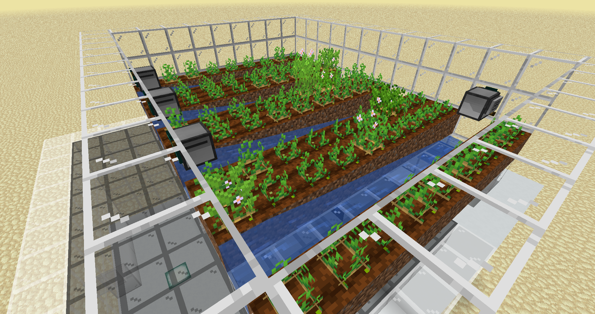
   

<h2>Store</h2>

There are three different zones of the store, only one accessible to the clients, the main store has a futuristic look and contains the vending machine and the ATM, the backstore contains the baked potatoes storage and some ladders to the server and pipes room.

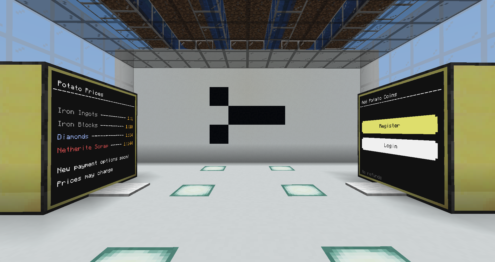
   

<h2>Vending Machine</h2>

The vending machine consists on 4 parts, the dispenser front, back, display and the pipe system.

 
<h3>Dispenser Front</h3>

This turtle is the one in charge of collecting the resources used as a payment option and giving the baked potatoes. The <a href="./scripts/dispenseFront.lua">dispenseFront.lua</a> program has to be called with two arguments, the dispenser back turtle's ID and the display computer's ID, then it waits for any change on it's inventory. If the item is an approved payment option it will communicate with the dispenser back and the display to process that information while it sends the items through the pipe system, if it's any other item it drops it up. It also has a pay limit, if it's exceded the client will have to wait some time until the vending machine can be used again. The startup code should look like this:<pre><code>edit startup shell.run("dispenseFront", "(ReceiverId) (DisplayId)")</code></pre>

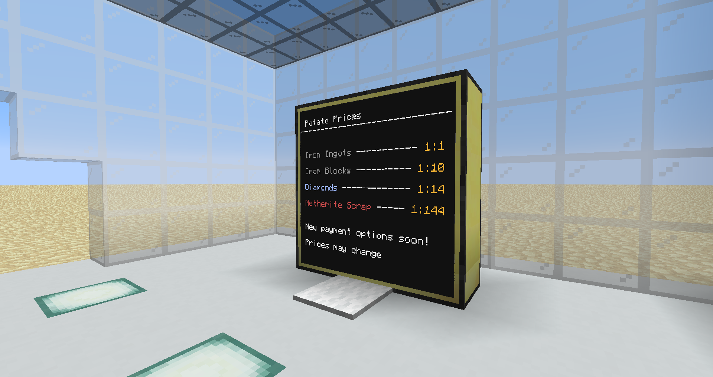
  
<h3>Dispenser Back</h3>

The dispenser front send the information of each transaction to the dispenser back turtle wich should be below the main baked potato chest. The <a href="./scripts/dispenseBack.lua">dispenseBack.lua</a> program has to be called with one argument, the server's ID which is discussed later, then it waits for any rednet message, after it receives one it will grab the baked potatoes specified on the message and sends them through the pipe system. It also communicates the server about the transaction. The startup code should look like this:<pre><code>edit startup shell.run("dispenseBack", "(ServerId)")</code></pre>

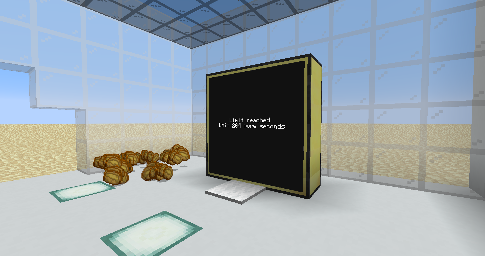
  
<h3>Dispenser Display</h3>

The display is connected to a computer next to the dispenser front and it's in charge of drawing on screen the prices of the potatoes, how the transaction is going and if the limit is activated how much time is left. The dispenser display uses the <a href="./scripts/dispenseDisplay.lua">dispenseDisplay.lua</a> program. The startup code should look like this:<pre><code>edit startup shell.run("dispenseDisplay")</code></pre>

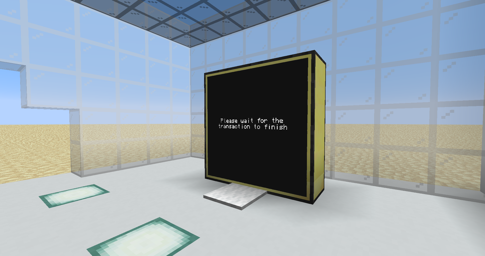
  
<h3>Pipe System</h3>

The pipe system is just a bunch of computers one next to each other that sends the items through them. The <a href="./scripts/pipe.lua">pipe.lua</a> program expects two arguments although only the first one is required, the direction of the baked potatoes and the direction of the resources, the options are "f" for front, "u" for up and "d" for down. The startup code should look like this:<pre><code>edit startup shell.run("pipe", "(potatoDirection) (resourcesDirection)")</code></pre>

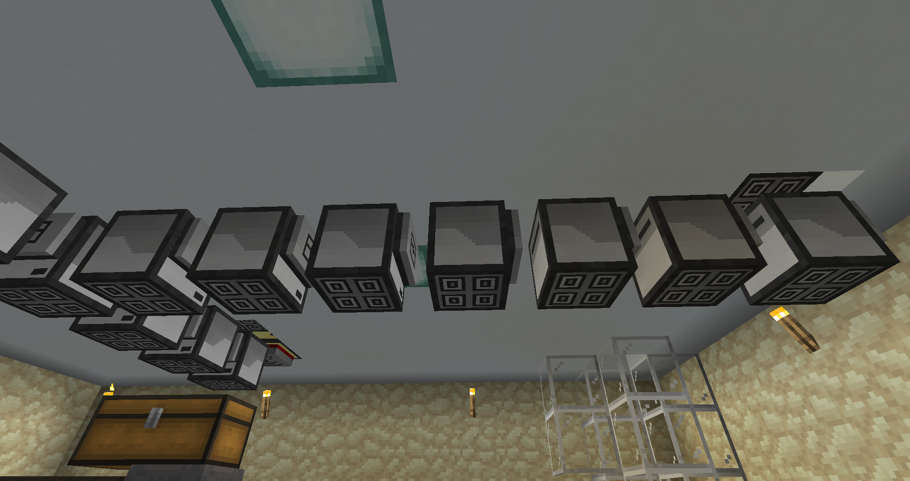
   

<h2>Server</h2>

The server has the function of controlling everything from only a single computer, it will not only show useful information but also manage the communication between sectors. The code for the entire server is in the <a href="./scripts/server.lua">server.lua</a> file. The startup code should look like this:<pre><code>edit startup shell.run("server")</code></pre>

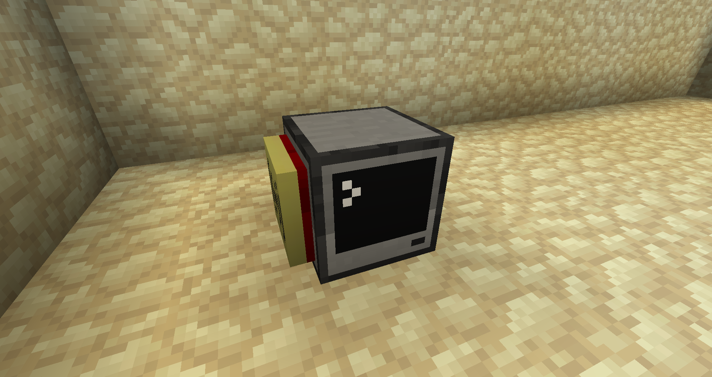
  
<h3>Potato Counter</h3>

The potato counter turtle is next to the dispenser back one, it's only purpose is to send the amount of potatoes stored in the chest to the server, it's definitely expendable but I find it kinda useful. It's code is <a href="./scripts/potatoCounter.lua">potatoCounter.lua</a> requires one argument wich is the server's id so the startup code should look like this:<pre><code>edit startup shell.run("potatoCounter", "(ServerId)")</code></pre>

 
<h3>Database API</h3>

To store the users and it's data I had to make my own database api based on plain text files, there are some functions to interact with the database, to add users, check if a user and a password matches, check a user's balance or change their balance. Those are already handled by the other systems on the project but if for any reason you want to add or change something the api can be used pretty easily.

  

<h2>ATM</h2>

The ATM is the way the clients can add balance to their accounts, as the screen says there are no refunds because I didn't implement them.

 
<h3>ATM Front</h3>

The ATM front takes the resources and sends them through the pipes system and then communicates with the display just like the dispenser front does, the difference is that this one will not give potatoes and it will only accept resources if the client has logged in, to acomplish that it uses asynchronous code. The <a href="./scripts/atmFront.lua">atmFront.lua</a> program will wait until the display computer sends a rednet request to the front indicating that the user has either registered or logged in. The startup code should look like this:<pre><code>edit startup shell.run("atmFront")</code></pre>

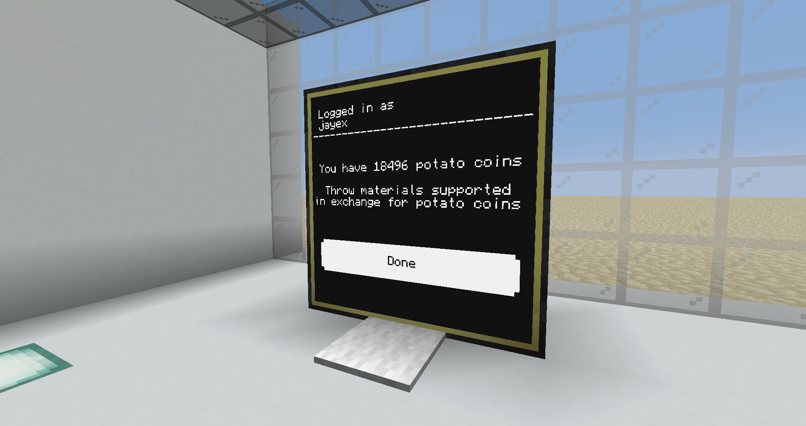
  
<h3>ATM Display</h3>

The ATM Display will show two buttons, one to register and the other to login, both buttons will lead to a form that one completed will verify the information on the server. If everything is correct the client will be redirected to the logged in screen wich will show the amount of potato coins he/she has and the ATM front will be unlocked. If resources are thrown to the floor turtle the potato coins on the screen will update as well as the database. Once the user has finished the done button should be pressed, that will prevent the ATM front from sucking and the display will return to the main screen. The code for the ATM display is the <a href="./scripts/atmDisplay.lua">atmDisplay.lua</a> and it requires two arguments, the id of the server and the id of the ATM front turtle. The startup code should look like this:<pre><code>edit startup shell.run("atmDisplay", "(ServerId) (ReceiverId)")</code></pre>

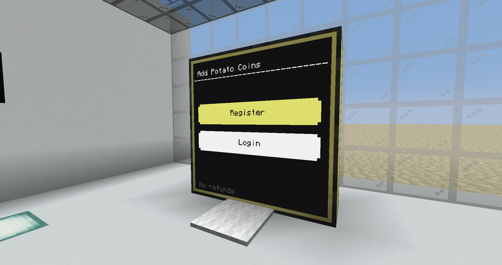
  
<h3>On-Screen Keyboard</h3>

ComputerCraft displays have the ability to get the user's mouse input but not the keyboard input so my idea was making an on-screen keyboard so the users could easily write their usernames and passwords.

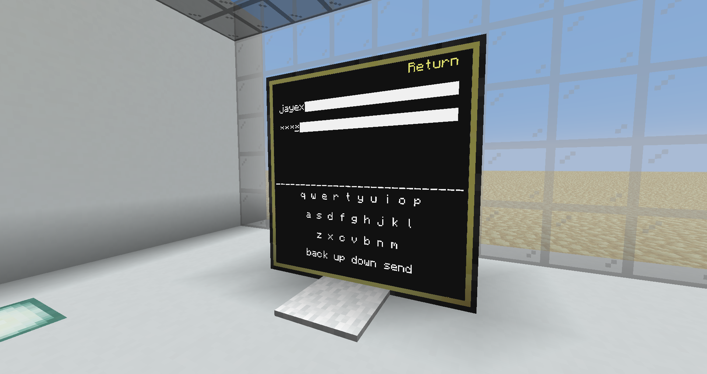
   

<h2>Drone Deploy</h2>

The potato coins are completely useless for now as you might realised, that's why I made a drone deployment code so the store could deliver baked potatoes to the door of the clients in exchange of their potato coins.

 
<h3>GPS</h3>

ComputerCraft has a default GPS api that lets you create a GPS host that any other turtle can send a request to get it's position based on the distance to the cluster of computers, here is a simple <a href="https://youtu.be/0_5W0gcZD8I">video</a> explaining how to do so.

 
<h3>Client</h3>

The client would have a computer with a modem attached with the <a href="./scripts/client.lua">client.lua</a> program in it, calling that program will send a drone to deliver potatoes to the computer's location as long as you execute it with the correct arguments, the first one must be the server's id, the second one the username of the client, the third one the password and finally the fourth one must be the quantity of potatoes will be delivered, if the quantity is grater than the balance of the user the drone will not be sent.

 
<h3>Deployer</h3>

The deployer is a mining turtle with a modem that has in it's storage more turtles with modems and coal, it's code is <a href="./scripts/deployer.lua">deployer.lua</a> and takes only one argument, the server's id. When it receives a petition from the server it will place a turtle and give it coal, after that it will turn the turtle on and get it's id so it can send the deliver information. The drone functions because there is a disk drive with a startup file in it next to the place where the drones are deployed. The startup code should look like this:<pre><code>edit startup shell.run("deployer", "(ServerId)")</code></pre>

 
<h3>Drone</h3>

The drone will deploy as soon as the deployer places it on the ground, the code of the drone is <a href="./scripts/drone.lua">drone.lua</a> and it must be stored in a disk drive with the name "startup.lua". When the drone starts it will go up to grab the requested potatoes after that it will leave the facility and fly up to the deliver hight, then it will calculate the route to the deliver location, go down to the ground and throw the potatoes. After that it will go to the return hight to minimize collisions and return to the facility where the deployer will break it and store it again

 
<video width="100%" autoplay loop>
<source src="./assets/client.mp4">
</video>
<video width="100%" autoplay loop>
<source src="./assets/deploy.mp4">
</video>
